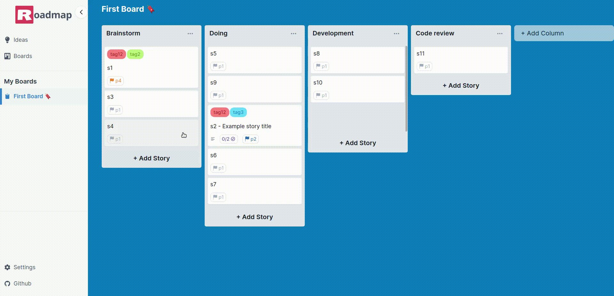

# Roadmap
A kanban board, project and idea management app built with React and IndexedDB.

## Demo


**[Visit the live app](https://roadmap-app.vercel.app)**

## Features

## Tech Stack
- Javascript, Typescript
- React, NextJS
- IndexedDB
- TailwindCSS, Chakra-ui
- Cypress

## Development
Clone the repository and install dependencies;
```bash
  git clone https://github.com/nareshbhusal/roadmap
  cd roadmap
  npm install
```

Run the dev server:
```bash
npm run dev
```

## Running Tests

To run tests, set up the development environment and then run the following command

```bash
  npm run test
```

## License

[MIT](https://github.com/nareshbhusal/roadmap/blob/main/LICENSE "MIT")
